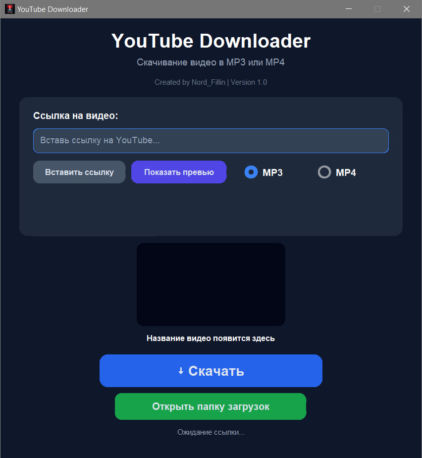
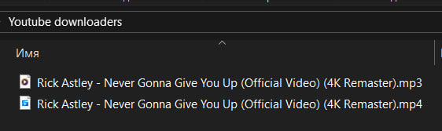

# YouTube Downloader

Modern YouTube downloader built with Python and CustomTkinter.

## Features

- MP3 download
- MP4 download
- Quality selection (360p, 480p, 720p, 1080p)
- Video thumbnail preview
- Video title preview
- Dark theme interface
- Automatic download folder creation
- FFmpeg bundled into executable

## Screenshots

## Main Interface

## Video Preview

## Quality Selection

## Downloaded Files

## Technologies

- Python
- CustomTkinter
- yt-dlp
- FFmpeg
- Pillow
- Requests

## Author

Nord_Fillin